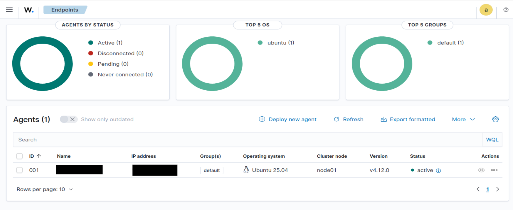
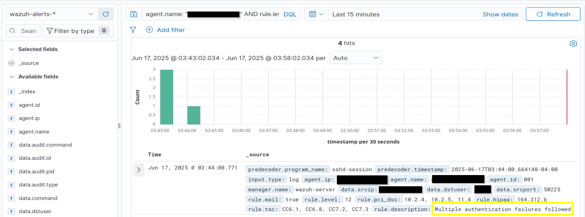
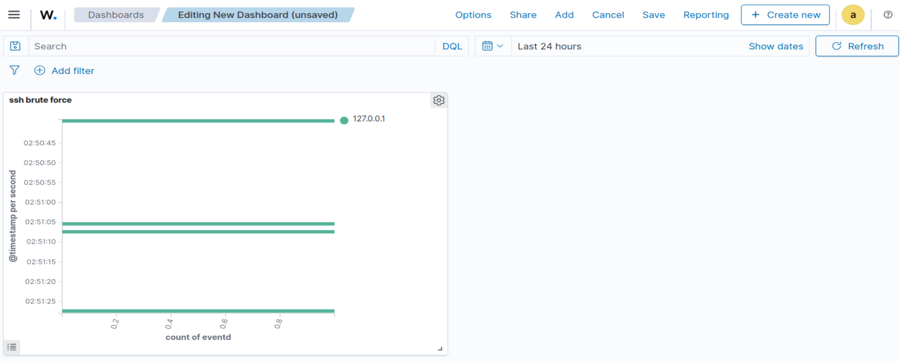

# 🛡️ Wazuh SIEM Home Lab Project

## 📌 Overview

This project demonstrates how to set up a home SOC (Security Operations Center) lab using Wazuh, an open-source SIEM solution. It walks through installing and configuring a Wazuh Manager and Agent, simulating security incidents, and detecting them using the Wazuh Web UI.

## 🧱 Architecture

### Components:

* **Wazuh Manager** (Ubuntu VM) — Receives, analyzes logs and manages agents.
* **Wazuh Agent** (Ubuntu Endpoint VM) — Collects logs, monitors system activity, forwards data to manager.
* **Networking**:

  * Dual adapter setup: NAT (for internet) + Host-Only (for agent-manager comms).
  * Communication over UDP port 1514.

```
+------------------+         UDP:1514         +------------------+
| Ubuntu Endpoint  | ----------------------> | Wazuh Manager     |
| (Agent Installed)|                         | (SIEM + Web UI)   |
+------------------+                         +------------------+
```

## ⚙️ Tools & Technologies

* **VirtualBox** for VM setup
* **Ubuntu 25.04**
* **Wazuh 4.12.0**
* **Kibana/OpenSearch Dashboards** for visualization
* **Git** and **VS Code** for documentation

## 🛠️ Setup Guide

### Step 1: Virtual Machine Setup

* Create two Ubuntu VMs.
* Configure **NAT + Host-Only** adapters in VirtualBox.
* Confirm internal network connectivity with `ping`.

### Step 2: Wazuh Manager Installation

* Install Wazuh using the official OVA or from package.
* Verify Wazuh Web UI on `http://<manager_ip>`
* Check manager service:

```bash
sudo systemctl status wazuh-manager
```

### Step 3: Wazuh Agent Setup

* Install agent on endpoint:

```bash
sudo apt install wazuh-agent
```

* Configure `/var/ossec/etc/ossec.conf`:

```xml
<client>
  <server>
    <address><manager_IP></address>
    <port>1514</port>
    <protocol>udp</protocol>
  </server>
</client>
```

* Start the agent:

```bash
sudo systemctl enable wazuh-agent
sudo systemctl start wazuh-agent
```

### Step 4: Agent Verification

* In Wazuh Web UI → `Management > Agents`
* Confirm status: `Active`, recent heartbeat

### Step 5: Simulate Security Events

* Run SSH brute-force attempts:

```bash
for i in {1..5}; do ssh fakeuser@localhost; done
```

* Modify system file:

```bash
sudo nano /etc/hosts
```

* Perform a port scan:

```bash
sudo apt install nmap
nmap 127.0.0.1
```

### Step 6: Analyze and Visualize

* View alerts in:

  * `Security > Events`
  * `Explore > Discover`
* Filter by:

```bash
agent.name: "name" AND rule.level >= 5
```

* Create dashboards:

  * SSH attacks over time
  * File integrity changes
  * Top alert categories

## 🧠 Lessons Learned

* How to configure host-only networks
* Troubleshooting Wazuh agent-manager communication
* Writing a clean `ossec.conf`
* Using Wazuh for log analysis and SIEM operations

## 📷 Screenshots

* Agent status: `Active`

* SSH brute-force alerts 
* Visual dashboard panels 

## 📁 Project Folder Structure

```
Wazuh-SIEM/
├── README.md
├── screenshots/
│   ├── agent-active.png
│   ├── alerts-ssh.png
└── └── alerts-dashboard.png
```

## 📚 References

* [Wazuh Documentation](https://documentation.wazuh.com/current/index.html)
* [MITRE ATT\&CK Framework](https://attack.mitre.org/)
* [Atomic Red Team](https://github.com/redcanaryco/atomic-red-team)
* [OpenSearch Dashboards](https://opensearch.org/)
* [Elastic SIEM Concepts](https://www.elastic.co/guide/en/security/current/overview.html)

---

**Author**: *Sharon Kota*

**Project URL**: [GitHub Repository](https://github.com/shaaronn/Wazuh-SIEM)
